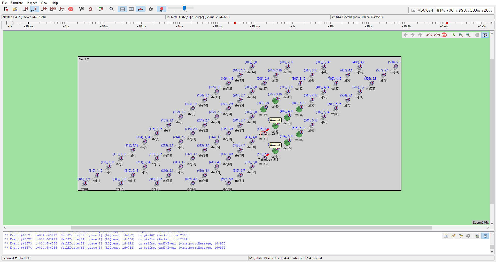

# Virtual Swarm of LEO Satellites  

**Final Year Project – Ben-Gurion University of the Negev**  
**Department of Electrical and Computer Engineering**  
**Students:** Ejnes Avidan, Alon Finestein  
**Supervisor:** Prof. Michael Segal  

---

## 📌 Overview
This project implements and simulates a **Low Power Virtual Swarm (LPVS) algorithm** for Low Earth Orbit (LEO) satellite constellations.  
A **virtual swarm** is dynamically generated above a geographical area from satellites moving in pre-defined orbits. The goal is to enable **distributed real-time data transfer** within the swarm while minimizing power consumption.

Our approach achieves synchronization of information among swarm members with lower accumulated hops compared to standard routing algorithms (e.g., MAODV).

---

## 🎯 Objectives
- Develop a **distributed algorithm** for data synchronization in virtual swarms.  
- Optimize:  
  - Synchronization time (time until the last member receives a message).  
  - Number of accumulated hops (proxy usage → power saving).  
- Evaluate algorithm performance in **realistic scenarios** using OMNeT++ simulations.

---

## 🛠️ Methods & Tools
- **Algorithm:** Low Power Virtual Swarm (LPVS)  
- **Simulator:** [OMNeT++](https://omnetpp.org/) (C++ discrete-event simulation library)  
- **Inputs:**  
  - Walker satellite constellation (75 satellites, 5 planes).  
  - Elbit Space Network Simulation Analysis data.  
  - Traffic generator (Matlab-based).  
- **Modules in Simulation:**  
  - **App Module** – implements LPVS logic.  
  - **Routing Module** – message routing between satellites.  
  - **Queue Module** – event handling for incoming packets.  

---

## 📊 Results
- Achieved **synchronization within 3 seconds** across tested scenarios.  
- Reduced **accumulated hops by ~25%** compared to MAODV.  
- Lower energy consumption due to fewer redundant transmissions.  
- Demonstrated robustness in handling **link failures and congestion**.

### Simulation Snapshots  

Below are visualizations from the OMNeT++ simulation environment:  

  
*Packet flow across satellite swarm – synchronized routing*  

  
*Data arrival confirmation at active satellites* 

---

## 📂 Repository Structure

```
LEO-Virtual-Swarm/
├── networks/           # OMNeT++ network topology files (.ned)
├── node/               # C++ source code for App, Routing, Queue modules
├── sheets/             # Traffic generator scripts and scenario data (CSV, XLSX)
├── results/            # Simulation output files (sca, vec, vci)
├── out/                # Build output (object files, executables)
├── outfiles/           # Processed results and exported data
├── mobility.xml        # Satellite mobility scenario
├── omnetpp.ini         # OMNeT++ simulation configuration
├── Makefile            # Build instructions
├── package.ned         # OMNeT++ package definition
├── NetLEO.anf          # Analysis file
├── README.md           # Project documentation
└── ...                 # Other config and support files
```
